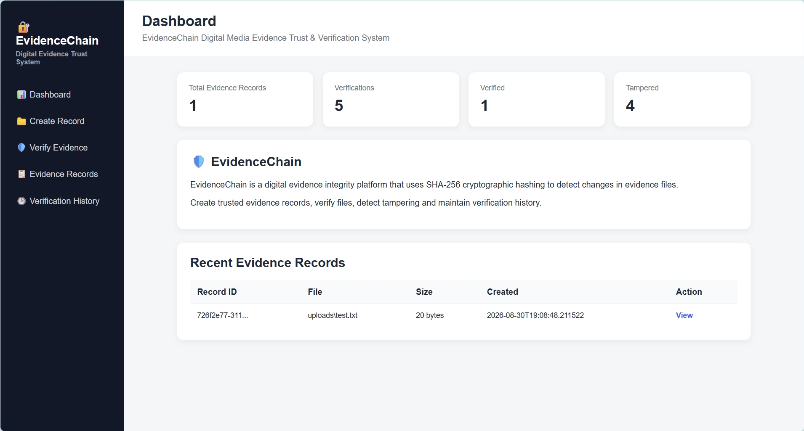
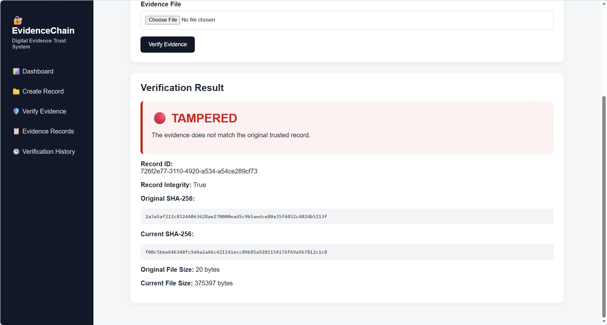

# 🔐 EvidenceChain

### Digital Media Evidence Trust & Verification System

A cybersecurity-focused digital evidence integrity platform that uses **SHA-256 cryptographic hashing** to create trusted evidence records, verify files, and detect tampering.

---

## 📸 Live Demonstration

### 📊 Dashboard



### 🔴 Tampered Evidence Detection



---

## 🎯 What is EvidenceChain?

Digital evidence can be modified after it is collected. Even a small change to a file can make its cryptographic fingerprint different.

EvidenceChain creates a trusted record of an evidence file and later compares the file's current SHA-256 hash with the original trusted hash.

```text
Original Evidence
       │
       ▼
   SHA-256 Hash
       │
       ▼
Trusted Evidence Record
       │
       │
       ▼
Current Evidence
       │
       ▼
   SHA-256 Hash
       │
       ▼
 Compare Hashes
    ┌──┴──┐
    ▼     ▼
 VERIFIED TAMPERED